# Project of "Electromagnetism for the transmission of information"

## INTRO
Obiettivo del nostro progetto intra - corso è stato la realizzazione di un programma MATLAB che, applicando la tecnica FDTD, simuli la propagazione della tensione e della corrente lungo una linea di trasmissione nel dominio del tempo.

## Metodo FDTD

Il metodo FDTD (finite-difference time-domain) è una tecnica proposta da Kane Yee nel 1966 per la risoluzione numerica delle equazioni di Maxwell per i campi elettromagnetici. L’algoritmo di Yee è basato sull’approssimazione alle differenze finite delle derivate nello spazio e nel tempo. La discretizzazione spaziale prevede il posizionamento dei campi, elettrici e magnetici (E ed H), attraverso una griglia che permette facilmente il calcolo delle derivate tramite differenze finite. In particolare i campi elettrici vengono posti lungo gli spigoli delle celle aventi dimensione (Δ𝑥,Δ𝑦,Δ𝑧), mentre i campi magnetici vengono posizionati al centro della superficie sottesa alla singola cella risultando così sfasati di mezza cella. Allo stesso modo per quanto riguarda la discretizzazione temporale, lo sfalsamento dei campi deve essere mantenuto anche nel tempo per cui E ed H devono essere valutati a tempi diversi di una quantità pari a mezzo passo di campionamento Δ𝑡.

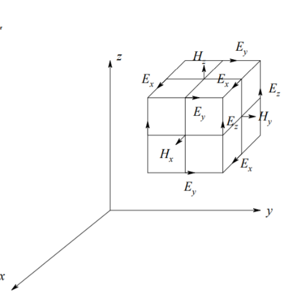  Figura 1 discretizzazione spaziale metodo FDTD

L’implementazione dell’algoritmo per quanto facile e concettualmente semplice presenta dei problemi di dispersione numerica, stabilità ed errori. Questi problemi sono superabili rispettando opportune condizioni. La prima:

 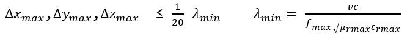
 
e l’altra condizione impone che l’incremento temporale Δ𝑡 adottato si mantenga entro un limite definito in funzione degli incrementi spaziali Δ𝑥,Δ𝑦,Δ𝑧 della griglia:
 
 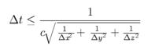

La tecnica FDTD può essere applicata ad un’ampia varietà di problemi complessi: radiazione di antenne in ambienti complessi, modellizzazione di circuiti a microonde, problemi di compatibilità elettromagnetica ecc. 
Il nostro progetto consiste nell’applicare la tecnica FDTD alle equazioni dei Telegrafisti:

 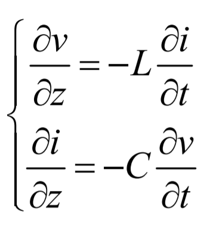 Figura 2 equazioni dei telegrafisti
 
per studiare la propagazione della tensione e della corrente lungo una linea di trasmissione nel dominio del tempo.

La nostra linea di trasmissione è un cavo coassiale lungo 3m avente raggio interno a = 2.8mm, raggio esterno b = 10mm, il cui dielettrico interno ha una ε_r=2.3.
Sono stati considerati 2 tipi di segnale:

1) segnale gaussiano di larghezza sigma=300ps (frequenza massima   circa 1.3GHz), ritardato di t0;
2) segnale sinusoidale di frequenza 1.4 GHz.

I comportamenti della tensione e della corrente sono stati analizzati in tre diversi punti della linea (all’inizio, a metà e sul carico), andando a considerare quattro tipologie di carico:
1) Resistenza adattata 
2) Resistenza disadattata
3) Carico induttivo
4) Carico capacitivo 

## Implementazione e grafici
Entriamo ora nello specifico con una descrizione accurata dei metodi adottati e delle scelte implementative effettuate.

L’implementazione dell’algoritmo è stata fatta suddividendo il cavo in celle infinitesime di dimensione dz =(c/sqrt(eps_R))/1.4*10^9, dove ogni cella conteneva un voltaggio e una corrente e discretizzando il tempo di analisi in funzione dei passi dz: 
dt = dz/c;
TA = (0:dt:max_time);
(con “c” velocità della luce, e “max_time” durata dell’animazione).

Le equazioni utilizzate per il seguente problema sono state :

 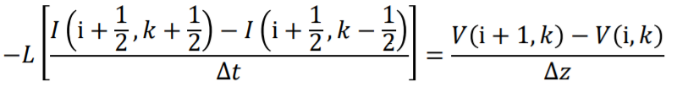
 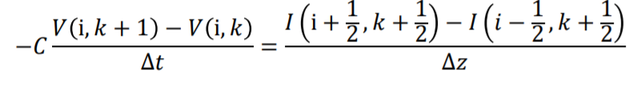
                   
che sono state implementate nel calcolatore nel seguente modo:

V(i) = V(i) + coefficient_L * (I(i) - I(i-1)); 
I(i) = I(i) + coefficient_C * (V(i+1) - V(i));

e inserite all’interno di due cicli for separati per rendere il processo più chiaro e semplice, dove la tensione della cella i-esima è in funzione della corrente della cella medesima e della corrente situata nella cella precedente.
Allo stesso modo il calcolo della corrente.
Abbiamo valutato il comportamento della tensione e della corrente in base al segnale e ai quattro tipi di carico richiesti applicando ad ogni carico le opportune condizioni al contorno.

Da analisi effettuate, vengono riportati alcuni grafici della tensione e della corrente in tre diversi punti della linea (inizio, metà e sul carico) al variare del tempo.

 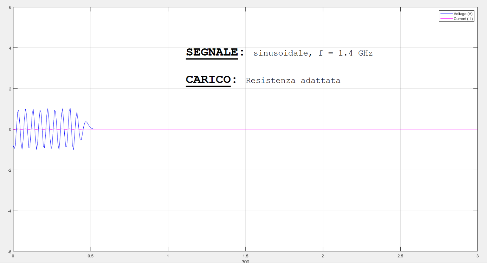 Figura 3 tensione e corrente lungo la linea con segnale sinusoidale, carico resistivo adattato (all'inizio della linea di trasmissione)
 
 Il segnale sinusoidale risulta molto fitto a causa dell’elevata frequenza (1,4x10^9Hz)
 
 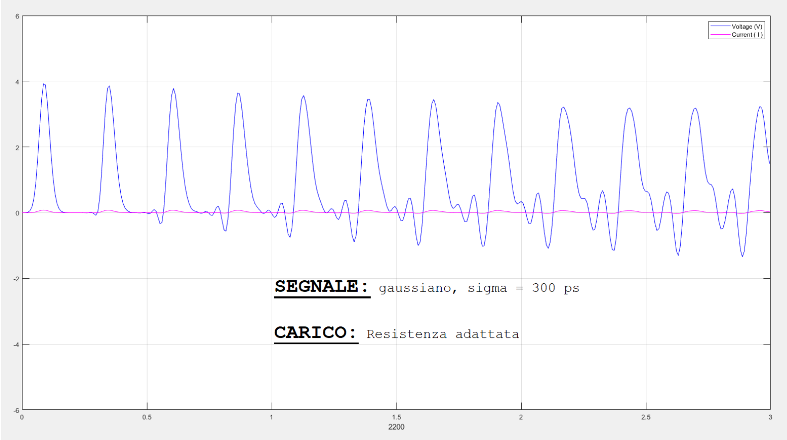 Figura 4 tensione e corrente lungo la linea con segnale gaussiano, carico resistivo adattato (a metà della linea di trasmissione)
 
 Il segnale gaussiano, come evidente da tale grafico, risulta non completamente corretto (presenta infatti picchi che non dovrebbe avere). Dopo diversi test ed analisi effettuate sul problema in questione, abbiamo pensato che questo comportamento potrebbe essere dovuto ad errori numerici e/o di approssimazione di Matlab.
  
 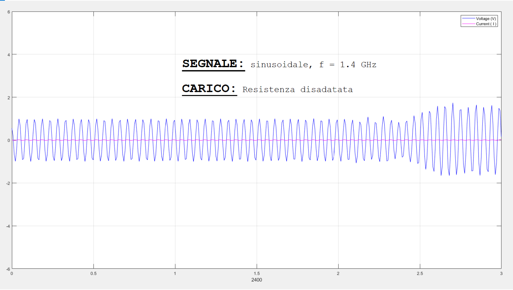 Figura 5 tensione e corrente lungo la linea con segnale sinusoidale, carico resistivo non adattato (a metà della linea di trasmissione)
 
 Il segnale alla fine della linea torna indietro e “rimbalza” a causa della presenza di un carico disadattato. Notiamo appunto delle riflessioni.

   
 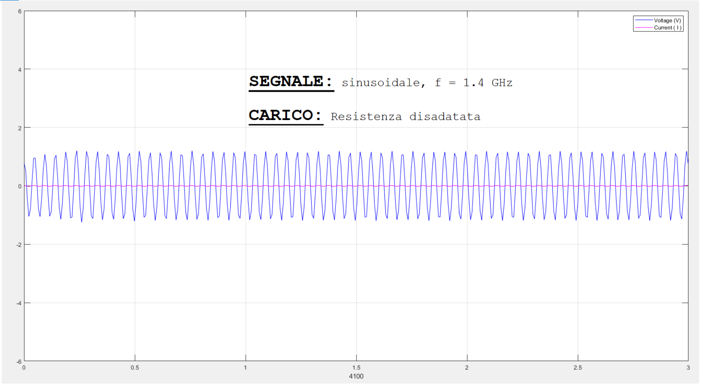 Figura 6 tensione e corrente lungo la linea con segnale sinusoidale, carico resistivo non adattato (alla fine della linea di trasmissione)
    
 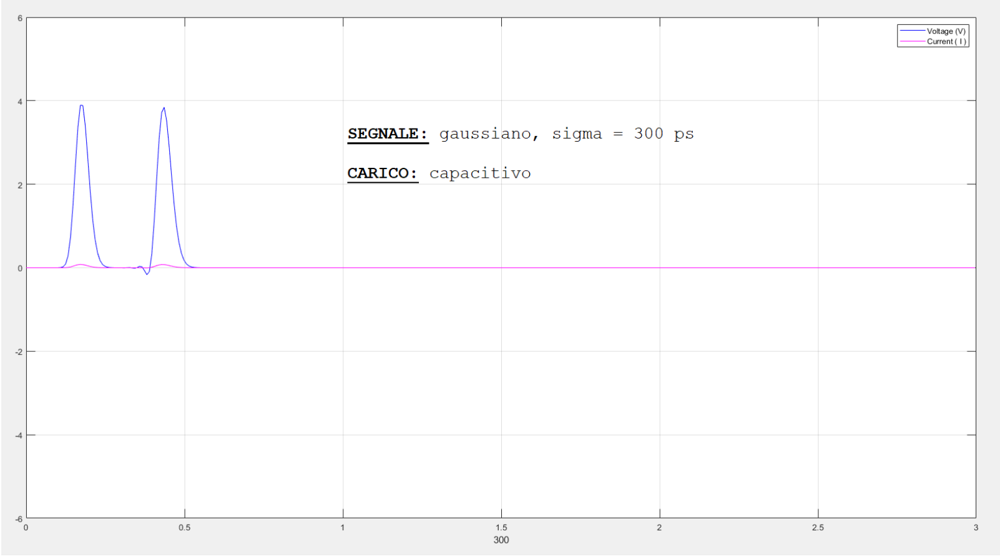 Figura 7 tensione e corrente lungo la linea con segnale gaussiano, carico capacitivo (all’inizio della linea di trasmissione)
     
 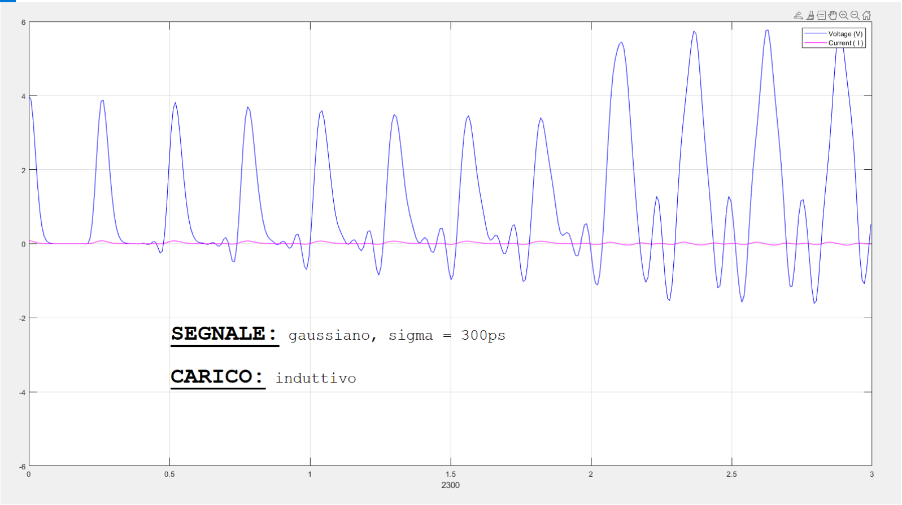 Figura 8 tensione e corrente lungo la linea con segnale gaussiano, carico induttivo (a metà della linea di trasmissione)
 
 Per selezionare la tipologia di segnale e/o la tipologia di carico, abbiamo pensato di utilizzare la command windows.

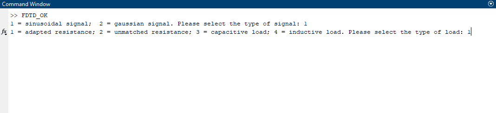 Figura 9 command windows

Come mostrato in figura 9, l’utente può selezionare agevolmente le condizioni desiderate seguendo le indicazioni fornite.

### L'intero lavoro è stato svolto da:
- Lucia Silla
- Michele Zurlo
    
© All rights are reserved to their respective owners. 
